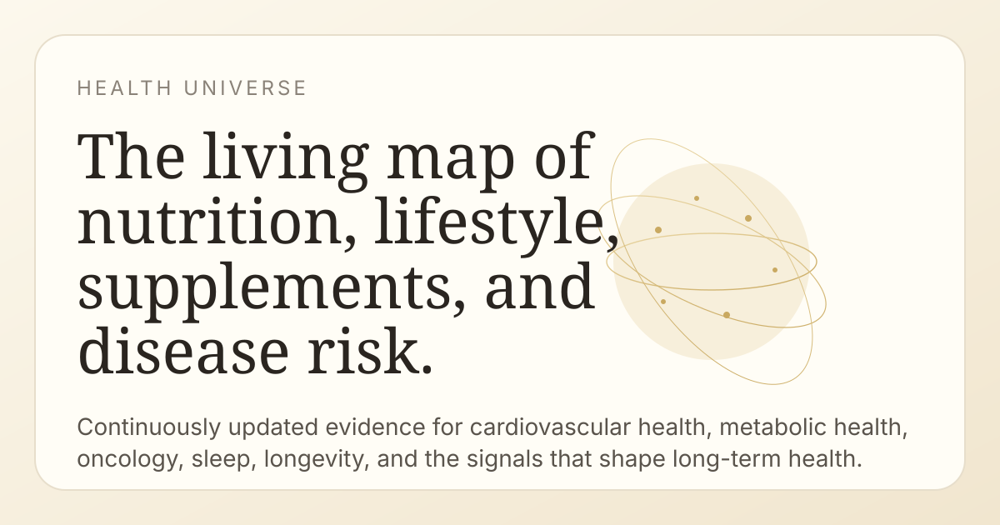

# Health Universe

Living knowledge graph of how nutrition, lifestyle, supplements, and environmental exposures affect chronic-disease risk.



## What it does

Health Universe stores each `(factor → outcome)` relationship as an evidence edge with:

- direction: protective, harmful, neutral, u-shaped, or mixed
- confidence tier: `A` through `D`, plus `X` for contested
- evidence rows and citations
- plain-language summary
- change history

The product surface is a stream of evidence cards on [health-universe.vercel.app](https://health-universe.vercel.app), plus per-edge detail pages.

## Stack

- FastAPI
- Jinja templates
- SQLite
- Anthropic SDK
- httpx

## LLM budget rule

This repo has a strict cost discipline:

- Claude is only for one-off seed deep research and critical adjudication
- Gemma via local Ollama is intended to do the daily work
- `claude_client.py` enforces a hard `$50 lifetime` cost cap
- never put Claude in a hot path

More detail is in [AGENTS.md](AGENTS.md).

## Quick start

```bash
git clone https://github.com/prokesmic/HealthUniverse.git
cd HealthUniverse
./setup.sh
cp .env.example .env
source .venv/bin/activate
uvicorn web.app:app --reload --port 8000
```

Run a single Claude seed pair:

```bash
python seed.py --pair magnesium,sleep_quality
```

Drain the queue:

```bash
python seed.py --next --limit 200
```

## Testing

```bash
python -m pytest -q
```

## App routes

- `/` home page
- `/tier/{tier}` evidence tier pages
- `/category/{slug}` category pages
- `/search?q=...` server-rendered search
- `/edge/{id}` edge detail page
- `/edge/{id}.png` OpenGraph share-card image
- `/sitemap.xml`
- `/robots.txt`

## Notes

- SQLite at `data/healthuniverse.db` is the source of truth
- Vercel reads the DB; offline scripts on the Mac write updates and then push to redeploy
- citations must never be fabricated
